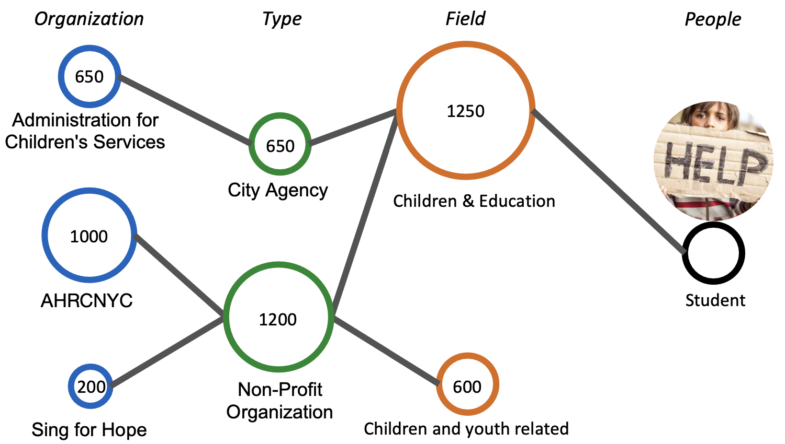

# Charity Resource Matching

> This work is part of the Tsinghua-Harvard Joint Course.
> The results are shown on The 3rd International Forum on Engineering Education (IFEE2022) held in Tsinghua University, Beijing, China, on 7-9 December 2022.

  
  
  

This is a project to match resources to charities. It is a work in progress.

## Primary Results

https://user-images.githubusercontent.com/60097359/206840032-b00665ae-6025-4634-9c44-875d12e5000b.mov

